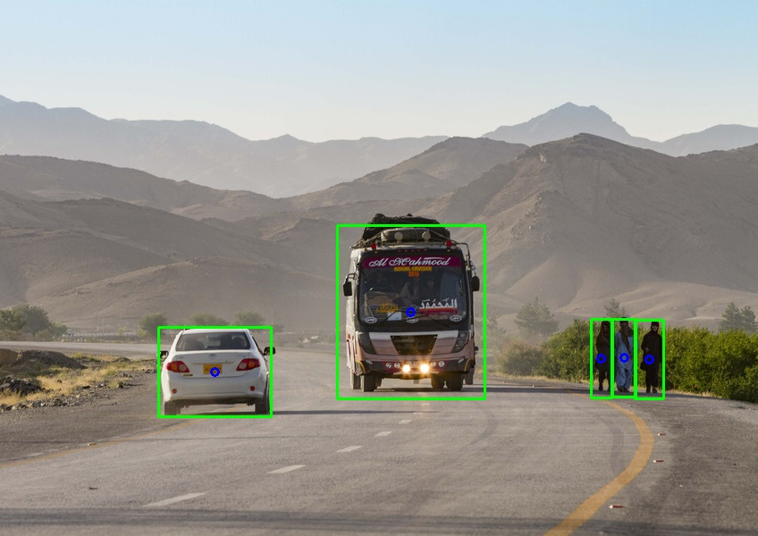

# CenterNet-Gluon

MXNet port of CenterNet (https://github.com/xingyizhou/CenterNet)

> [**Objects as Points**](http://arxiv.org/abs/1904.07850),
> Xingyi Zhou, Dequan Wang, Philipp Kr&auml;henb&uuml;hl,
> *arXiv technical report ([arXiv 1904.07850](http://arxiv.org/abs/1904.07850))*

### Abstract
Detection identifies objects as axis-aligned boxes in an image. Most successful object detectors enumerate a nearly exhaustive list of potential object locations and classify each. This is wasteful, inefficient, and requires additional post-processing. In this paper, we take a different approach. We model an object as a single point -- the center point of its bounding box. Our detector uses keypoint estimation to find center points and regresses to all other object properties, such as size, 3D location, orientation, and even pose. Our center point based approach, CenterNet, is end-to-end differentiable, simpler, faster, and more accurate than corresponding bounding box based detectors. CenterNet achieves the best speed-accuracy trade-off on the MS COCO dataset, with 28.1% AP at 142 FPS, 37.4% AP at 52 FPS, and 45.1% AP with multi-scale testing at 1.4 FPS. We use the same approach to estimate 3D bounding box in the KITTI benchmark and human pose on the COCO keypoint dataset. Our method performs competitively with sophisticated multi-stage methods and runs in real-time.

<p align="center">
  
</p>

### Overview
CenterNet is a generic network design that works for various regression tasks.
The offical code solves the problems of: (1) 2D object detection, (2) 3D object detection and (3) multi-person pose estimation.

Objects are represented as points, which spatially locate these objects. Other attributes related to the objects are regressed accordingly.
CenterNet is simpler in concept than previous single-shot object detectors:
- No NMS
- No anchor boxes (or can be considered one positive "anchor" per object, as the author put it)
- One feature map for multiple scales

### What's done
- Implementation of these networks: (1) Hourglass, (2) Resnet18-dcn
- 2D object detection task
- Training and validation on COCO dataset
- Demo of the 2D object detection task

### TODO
- Add other tasks: multi-person pose estimation, 3D object detection
- Add utility for other datasets

### Example commands

- Demo 2D object detection on an image folder:

  ```Shell
  python demo.py --arch res_18 --load_model CenterNet_res_18_0136.params --gpus 0 --demo images/
  ```

- Train CenterNet with hourglass network for 2D object detection:

  ```Shell
  python train.py --gpu 0,1,2,3 --batch_size 24 --arch hourglass --num_workers 8 --lr 5e-4
  ```

- Finetune CenterNet with resnet18-dcn network for 2D object detection:

  ```Shell
  python train.py --gpu 0,1,2,3 --batch_size 100 --arch res_18 --num_workers 16 --lr 1e-4 \
  --flag_finetune --pretrained_path CenterNet_res_18_0060.params
  ```


## Official Implementation by Xingyi Zhou
- PyTorch: https://github.com/xingyizhou/CenterNet

## Other Ports
- Keras: https://github.com/see--/keras-centernet
